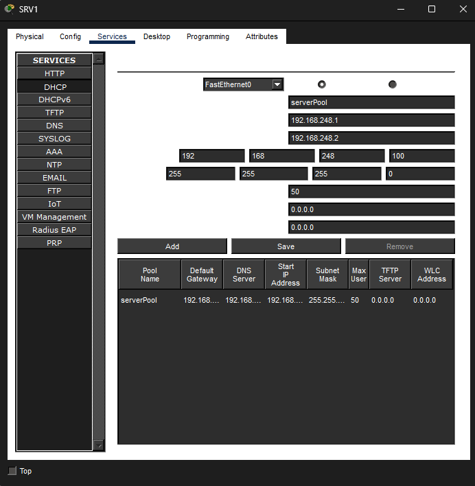
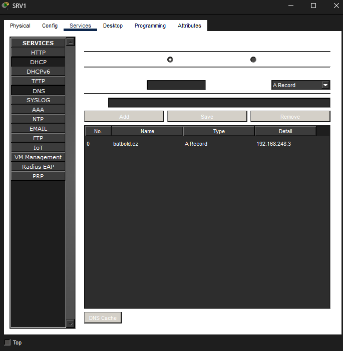
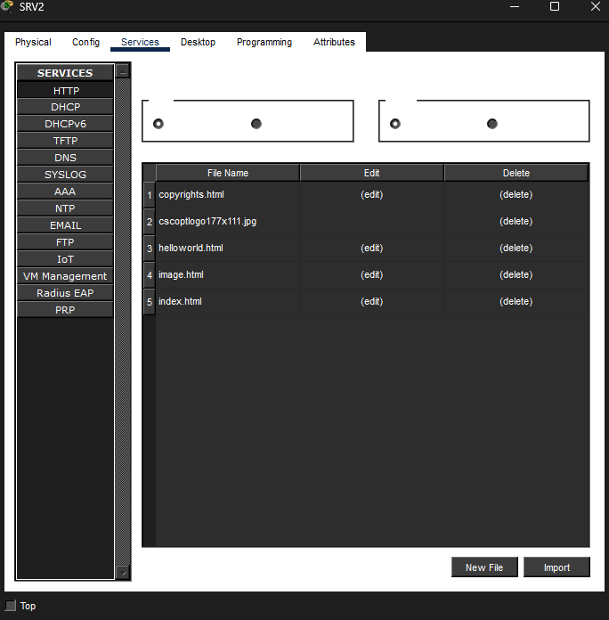
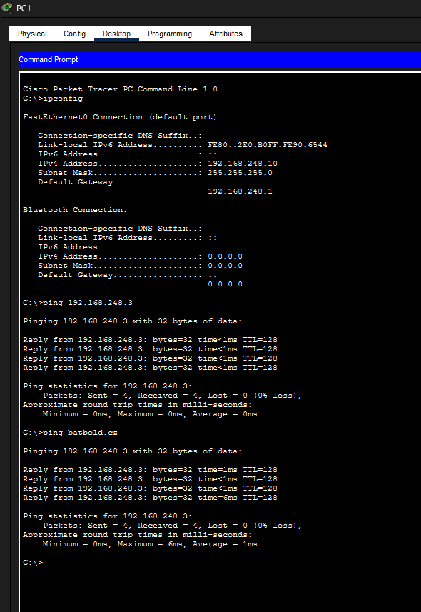
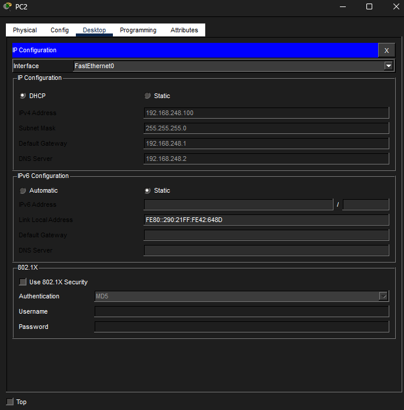
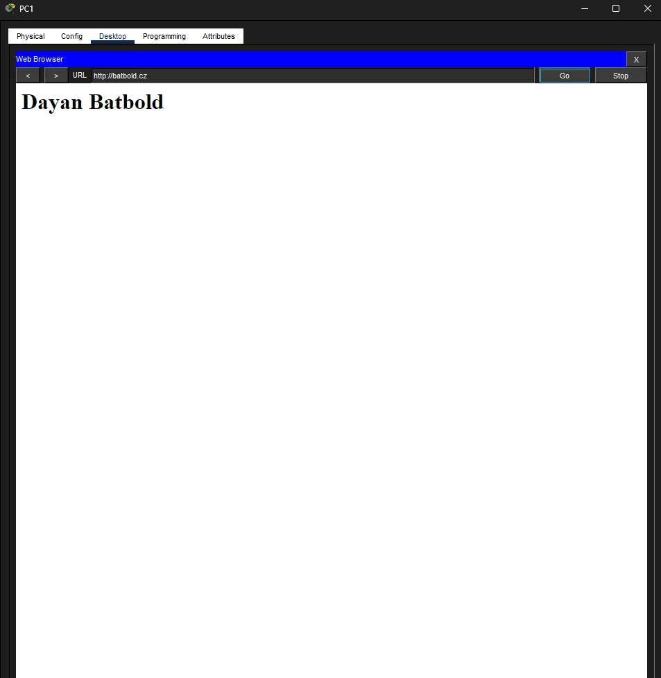

# Packet Tracer - LAN

## Jméno a příjmení
Dayan Batbold

## Datum
19. 4 . 2026

## Výpočet X

Příjmení: **BATBOLD**

| Písmeno | ASCII |
|--------|------|
| B | 66 |
| A | 65 |
| T | 84 |
| B | 66 |
| O | 79 |
| L | 76 |
| D | 68 |

66 + 65 + 84 + 66 + 79 + 76 + 68 = **504**

504 mod 256 = **248**

**X = 248**

---

## DNS

**batbold.cz** → 192.168.248.3

---

## Snímky obrazovky

### DHCP

### DNS

### WEB server

### PC1

### PC2

### Web prohlížeč

